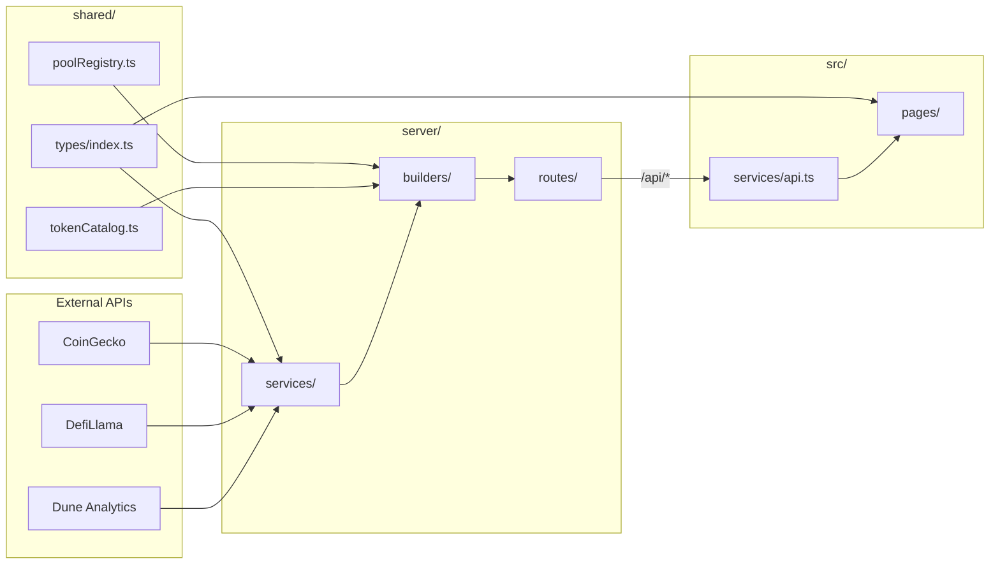

# Architecture

## Stack

| Layer | Tech |
|-------|------|
| Frontend | React 19, Vite 8, React Router 7, Chart.js 4 |
| Backend | Express 5, tsx |
| Shared | TypeScript types + static data |

## Data Flow



## Layer Responsibilities

### `shared/`
- **No React, no Express** — pure TypeScript
- Types, static registries, API URL constants
- Imported by both `server/` and `src/`

### `server/services/`
- One file per external provider
- Raw fetch + parse only — no HTTP response shaping

### `server/builders/`
- Merge registry + live API data
- Output typed `DashboardData` / `ChartsData`

### `server/routes/`
- HTTP handlers, caching, error fallbacks

### `src/services/api.ts`
- Thin `fetch('/api/...')` wrappers
- Falls back to `placeholders.ts` when backend is down

### `src/pages/`
- UI only — no direct external API calls

## Production

```bash
npm run build
NODE_ENV=production npm run server
```

Express serves `dist/` + API on the same port.

## Dev

Vite `:5173` proxies `/api` → Express `:3001` (see `vite.config.ts`).
